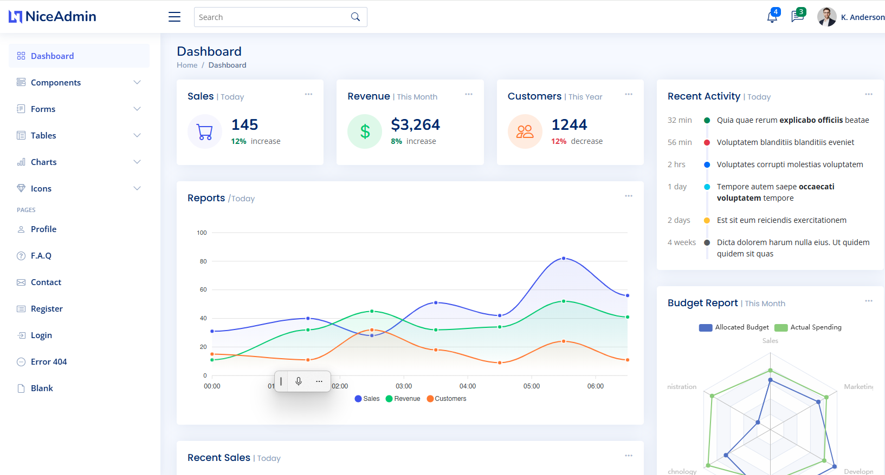

# README.md

# Sadmin Dashboard - .NET Core Implementation

[](https://dotnet.microsoft.com/)
[](https://opensource.org/licenses/MIT)



A modern admin dashboard implemented in .NET Core 6, based on NiceAdmin template.

## Features
- User management system
- Responsive layout
- Role-based access control
- Data visualization
- Cross-platform support

## Installation
```bash
git clone https://github.com/sunn789/Dashboard9.git
dotnet restore
dotnet run